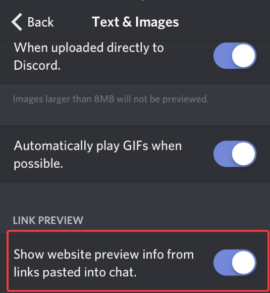

# Frequently Asked Questions



### Why does @everyone and @here not work with Atlas?

Atlas will purposefully filter out @everyone and @here to prevent abuse. There is currently no way to disable this behaviour.

### How do I create a starboard?

Check the [Fun](plugins/fun.md) plugin on the dashboard.

### Why is Atlas sending empty messages?

You have embeds disabled. To enable them, go into user settings, "Text & Images"  

then check "Show website preview info from links pasted into chat".

 

### Atlas isn't responding to commands in my server!

First, make sure Atlas is still in your server. This might be obvious, but most of the time an admin has just removed the bot. If Atlas is in your server, make sure it has permission to read and send messages in the channel you're trying to call it in. 

  
You could be using the wrong prefix, `@Atlas <command>` will always work regardless regardless of the servers prefix.

Atlas could be undergoing maintenance. Check the status page at [https://atlasbot.xyz/status](https://atlasbot.xyz/status) - if you're signed in then make sure the cluster with your guild icon is online. If it isn't, wait 30 minutes and it should be back.

If all else fails, join our [Support Server](support-server.md) and we'll gladly take a look, so long as you've tried yourself first.



### How do I remove a users warnings?

`a!warn remove @user` will bring up an embed where you can remove warnings. If you know the exact warning text, you can do `a!warn remove @user <warning reason>` and it will remove the best match.

### When will &lt;insert version&gt; be out?

Stop it.

### 



