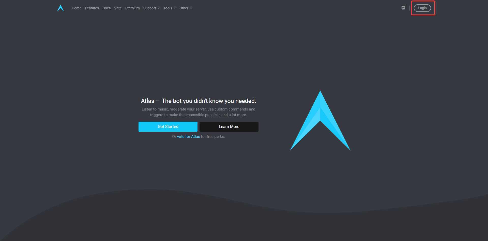
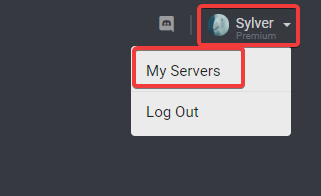
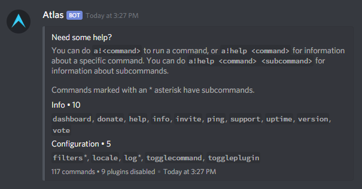

# Getting Started

Getting started with Atlas is very easy. All you need is a Discord server that you have Administrator privileges in, and a few minutes of your time.

Head over to [https://atlasbot.xyz](https://atlasbot.xyz) and sign in with your Discord account at the top left.

Follow the prompts. Once you're back at the homepage, go hover over your username in the top right and select "My Servers".

From the "My Servers" page you can click on any of your servers to add Atlas to it. Once you select a server and follow the prompts, you'll be dumped into your dashboard for the server. From here, you'll want to enable the plugins you're interested in and configure Atlas to fit your needs. Clicking on a grayed-out plugin will prompt you to enable it.

Some plugins come enabled by default, notably "Info" and "Configuration". The Info plugin helps users with Atlas, and provides some general commands. The "Configuration" plugin provides some frequently-used configuration commands. Not all commands are in the configuration plugin, so you'll want to use the dashboard a majority of the time.

If you get lost at any time, you can join our support server at [https://atlasbot.xyz/support](https://atlasbot.xyz/support) and ask in any of the support channels.

## Using Atlas

Once Atlas is in your server, you can run commands. To view all commands that are available, you can send a message to a channel that Atlas can see with the content `a!help`. If all goes well, you'll be shown available commands. If you haven't enabled any plugins yet, you'll only see some basic commands from plugins that come enabled.

Commands in the help message that have a `*` suffix have sub-commands available. Regardless of the command, you can do `a!help <command>` for more info on it. For example, to find out what the "ping" command does, you can do `a!help ping`.

From here, you'll want to explore Atlas yourself. Enable plugins and look at their commands, and configure more advanced plugins like Moderation for your server.

