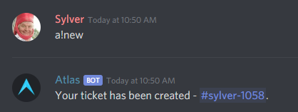
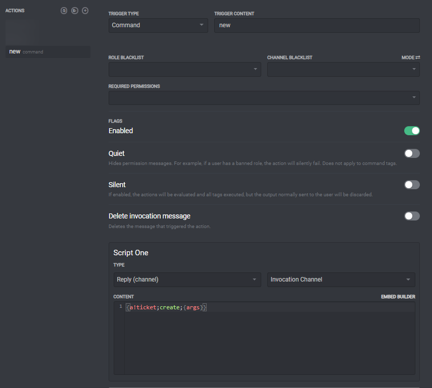

# Creating Command Aliases

Sometimes you might want a custom alias that Atlas doesn't provide by default. We'll be using [Command Tags](../tags/command-tags.md) to create a simple alias which rewrites `a!new ...` to `a!ticket create ...`.

#### How we're gonna do it

Using two simple tags, `{a!ticket}` and `{args}`, we can forward everything to `a!ticket create`. `{args}` will give us all the arguments the user gives when running the command. For example, in`a!new hi :)` `{args}` would return `hi :).`

With the args, we simply use the `{a!ticket}` tag to call the `create` sub-command with the users arguments.

#### The code

`{a!ticket;create;{args}}`

#### Outcome

#### The whole Action

