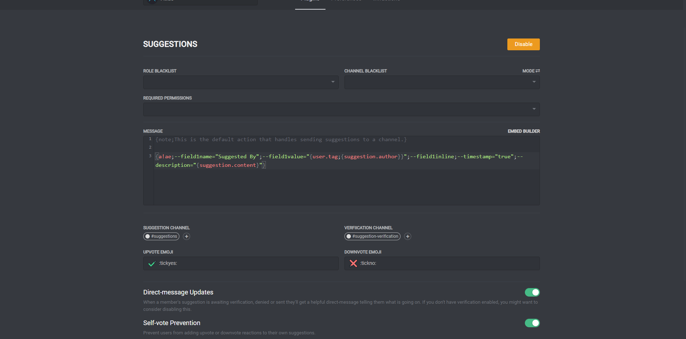

# Suggestions

Suggestions are a powerful way to let members have their say. They can be used for anything - suggesting new features for the server, for your product, or whatever you feel like.

## Options

You can provide a custom suggestion format, which controls what Atlas will send to the suggestion channel once a suggestion has been verified. This supports most tags, including the {suggestion} group.

"Suggestion Channel" is where suggestions will end up once they've been approved. If a message is sent to the suggestion channel, the message will be submitted as a suggestion as though the author ran "a!suggest".

"Verification Channel" is where suggestions are initially sent. Anyone who can view the channel can react with the upvote or downvote emoji. If the downvote emoji is picked, the suggestion will be denied and the user will be notified. If the upvote emoji is selected, the suggestion will be published in the suggestion channel. If no verification channel is provided, verification will be skipped and new suggestions will be sent straight to the suggestions channel.

"Upvote Emoji" and "Downvote Emoji" are the emojis users use for scoring suggestions.

"Direct-message updates" controls whether Atlas will notify the user when their suggestion is awaiting verification, approved or denied.

"Self-vote prevention" will remove reactions from the suggestion author on their own suggestion.

