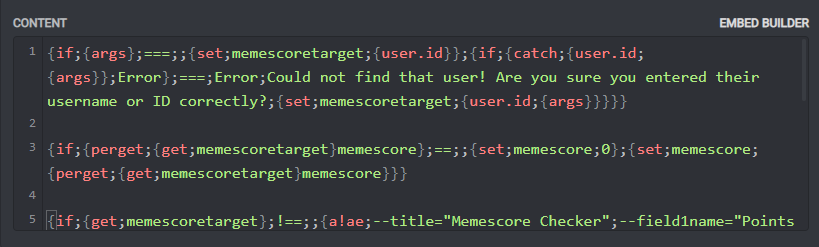
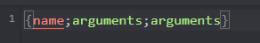
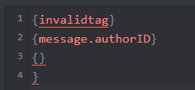

# Tag Editor

The Tag Editor is apart of the dashboard. It helps you when writing tags and reading content that uses tags. It gives you advanced features like line numbers, syntax highlighting and suggestions. Anywhere that tags are supported, the tag editor will be available, so long as you are on a desktop computer.

The editor is not available on mobile due CodeMirror not fully supporting them yet. If it looks like you're on a phone or tablet, the editor will be replaced with a regular text field.

## Syntax Highlighting

When you enter a tag, the tag name will become red and the tag arguments will become green. 

## Suggestions

Tag suggestions try to intelligently guess what you're typing and show suggestions for your text. They'll show up when you're typing a tag name, when you enter a `{` bracket or when it thinks you might want them. You can force suggestions to show up by pressing `Ctrl + Space` on your keyboard, where it will use either the text block your cursor is on or show all available tags if it can't find one.

If suggestions show up, you can press the `Tab` key to use the top suggestion, and use your up/down arrow keys to select a specific suggestion if the top one isn't what you're after.

## Linting

When the tag editor notices you've entered a invalid tag name or have unbalanced brackets, it'll warn you by underlining it in red.

## Other Features

* You can hover your mouse over the bottom of the tag editor and drag to resize the height of it to fit your content. 
* Matching brackets will be highlighted when your cursor is on either end of them. This will be disabled for performance if your content or the line you're on is too large.
* The line your cursor is on will be lighter then other lines to make it easier to follow your content. 

