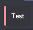

# user.color &lt;hex=false&gt; &lt;user&gt;

This tag will return the color of a user based on their highest role in role hierarchy. If hex is true, the value will be returned as a valid [hex code](https://en.wikipedia.org/wiki/Web_colors#Hex_triplet) - this is the default behavior. If hex is false, the output will be the raw role color from Discord - info at [https://discordapp.com/developers/docs/topics/permissions\#role-object-role-structure](https://discordapp.com/developers/docs/topics/permissions#role-object-role-structure)

## [Context Requirements](../tags.md#context-requirements)

`user` and `settings`

## Examples





```text
{user.color}
```





```text
#95a5a6
```







```text
{user.color;true;Atlas}
```





```text
#03a9f4
```







```text
{user.color;true}
```





```text
9807270
```







```text
{a!ae;--color="{user.color;true}";--title="Test"}
```



####  




